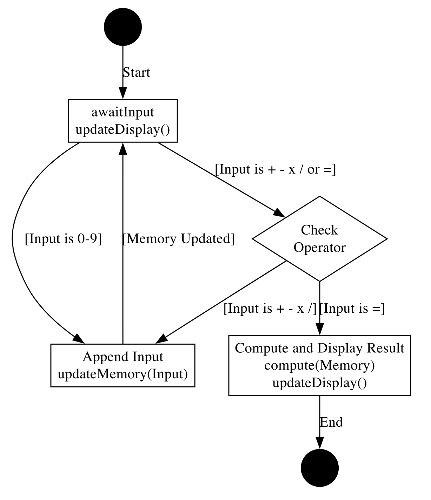
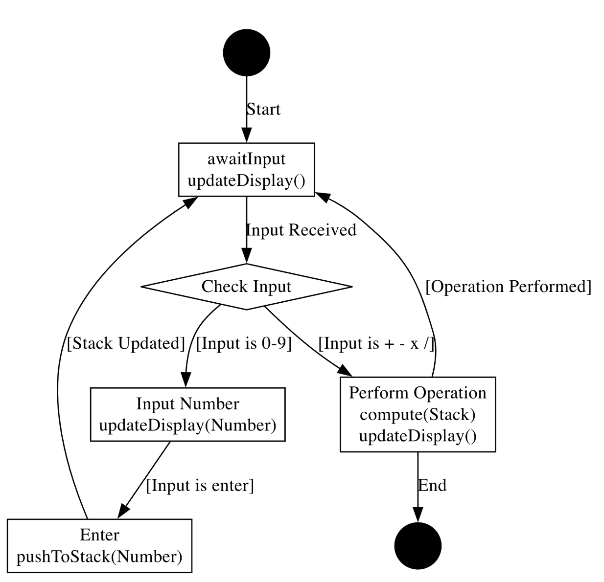
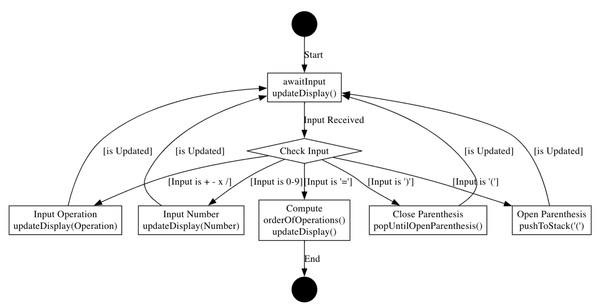

# 🧮 Multi Calculator Project

Welcome to the Multi Calculator Project repository! This project features three distinct types of calculators: INFIX, RPN, and BEDMAS, each implemented in Python. These calculators are designed to handle basic arithmetic operations in different ways to suit various user preferences and computational needs.

## 🧾 Calculators

### 1. INFIX Calculator (calc1.py)

The INFIX calculator allows users to input expressions as they would typically write them, using standard operator precedence.

<p align="center">
    <a href="">
        
    </a>
</p>

### 2. RPN Calculator (calc2.py)

The RPN (Reverse Polish Notation) calculator requires users to input their operations in postfix format. This method eliminates the need for parentheses to denote operation order.

<p align="center">
    <a href="">
        
    </a>
</p>

### 3. BEDMAS Calculator (calc3.py)

This calculator, following the BEDMAS/BODMAS order of operations, automatically handles the precedence of operations as dictated by standard mathematical rules.

<p align="center">
    <a href="">
        
    </a>
</p>

## 🛠 Installation

To run any of the calculators, you need to have Python installed on your computer. After cloning this repository, you can run each calculator by executing its corresponding Python file.

```bash
python calc1.py  # Runs the INFIX Calculator
python calc2.py  # Runs the RPN Calculator
python calc3.py  # Runs the BEDMAS Calculator
```

## 📝 Input Logging
Each calculator logs every key press, including its timestamp, to a CSV file for further reference. This feature is essential for tracking the sequence of operations, troubleshooting issues, and analyzing usage patterns over time. Example log entries are as follows:

```bash
2024-03-28 09:58:27.219382,5
2024-03-28 09:58:28.959074,+
2024-03-28 10:04:04.693276,=
```

This logging mechanism ensures that all calculator interactions are recorded precisely, providing a valuable dataset for further analysis or verification of operations.

## 📖 Documentation

For more detailed information about the design and functionality of each calculator, refer to the [Design Documentation](resources/Design_Documentation.pdf).

## ✨ Conclusion

Each calculator model has been designed to offer a different approach to handling user input and computation, making this project a versatile tool for educational purposes, especially in understanding different parsing and computation strategies in software design.

